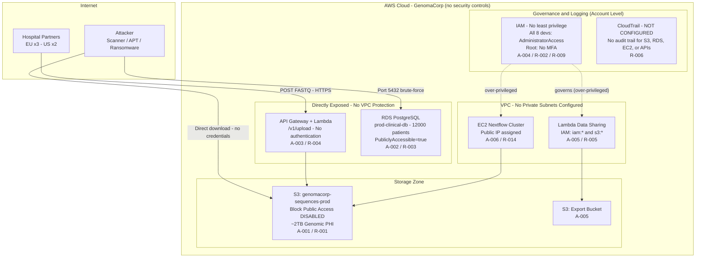

# Architecture Diagram — GenomaCorp AWS Environment

```mermaid
flowchart TB
  subgraph Internet["Internet"]
    Partners["Hospital Partners<br/>EU x3 - US x2"]
    Attacker["Attacker<br/>Scanner / APT / Ransomware"]
  end

  subgraph AWS["AWS Cloud - GenomaCorp (no security controls)"]
    subgraph VPC["VPC - No Private Subnets Configured"]
      LambdaShare["Lambda Data Sharing<br/>IAM: iam:* and s3:*<br/>A-005 / R-005"]
      EC2["EC2 Nextflow Cluster<br/>Public IP assigned<br/>A-006 / R-014"]
    end

    subgraph Gov["Governance and Logging (Account Level)"]
      IAM["IAM - No least privilege<br/>All 8 devs: AdministratorAccess<br/>Root: No MFA<br/>A-004 / R-002 / R-009"]
      CT["CloudTrail - NOT CONFIGURED<br/>No audit trail for S3, RDS, EC2, or APIs<br/>R-006"]
    end

    subgraph Exposed["Directly Exposed - No VPC Protection"]
      API["API Gateway + Lambda<br/>/v1/upload - No authentication<br/>A-003 / R-004"]
      RDS["RDS PostgreSQL<br/>prod-clinical-db - 12000 patients<br/>PubliclyAccessible=true<br/>A-002 / R-003"]
    end

    subgraph Storage["Storage Zone"]
      S3Main["S3: genomacorp-sequences-prod<br/>Block Public Access DISABLED<br/>~2TB Genomic PHI<br/>A-001 / R-001"]
      S3Export["S3: Export Bucket<br/>A-005"]
    end
  end

  Partners -->|"POST FASTQ - HTTPS"| API
  Attacker -->|"Port 5432 brute-force"| RDS
  Attacker -->|"Direct download - no credentials"| S3Main
  IAM -.->|"governs (over-privileged)"| LambdaShare
  IAM -.->|"over-privileged"| EC2
  API --> S3Main
  LambdaShare --> S3Export
  EC2 --> S3Main
```
